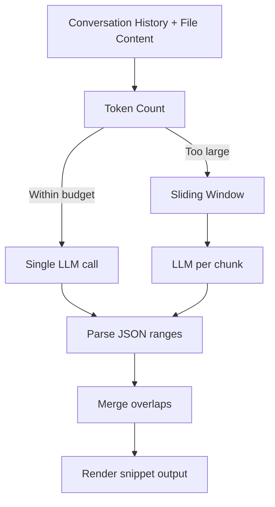

# Content Extractor

**This package is not used** 
The `internal/content_extractor` package wraps a large language model (LLM)
to locate the most relevant code spans inside a file, based on the user’s
conversation history. This module is consumed by the agent when it wants to
automatically surface the precise snippets that matter for a follow-up
question or inspection step.

## Design Overview

1. **Extractor struct** – Bundles the LLM handle, token counter, sliding
   window parameters, and the maximum safe token budget. This object is cheap
   to construct and can be reused across requests.
2. **Prompt templates** – The role and task prompts live next to the extractor
   implementation so their wording stays version-controlled alongside the call
   logic. A `PartialNotice` marker is injected when only a subset of the file
   is visible to the model.
3. **Sliding window splitter** – Very large files are broken into overlapping
   windows (`window_size` rows with `overlap` rows of context). Each chunk can
   be processed independently, minimizing the number of model tokens needed.
4. **Chunk inference** – For every chunk, the extractor calls `@openai.json`
   with the formatted prompt and conversation history. The LLM must produce a
   JSON array of `{ "start_line", "end_line" }` objects.
5. **Post-processing** – All chunk responses are decoded, merged to remove
   overlapping ranges, and rendered back into a human-readable snippet block
   that annotates each line range with its original text.

## Typical Flow

## Configuration Knobs

| Parameter | Default | Purpose |
|-----------|---------|---------|
| `safe_zone_tokens` | required | Upper bound before chunking kicks in |
| `window_size` | `100` lines | Number of rows per chunk |
| `overlap` | `20` lines | Context preserved between adjacent chunks |

Tuning these values gives a trade-off between the number of model calls and the
risk of losing context at chunk boundaries.

## Testing Notes

- `extractor_test.mbt` provides an integration-style test that drives the
  extractor using the MoonBit prompt. It is marked `#skip` because it requires
  live LLM responses and API credentials.
- When adding unit tests, prefer to mock `@openai.json` so CI runs stay
  deterministic.

## Extensibility Ideas

- **Structured coverage** – Emit richer metadata (e.g., snippet confidence) so
the agent can prioritize follow-up actions.
- **Batching** – Submit multiple chunks in a single API request for models that
support batched inputs.
- **Model adapters** – Abstract the prompt format to support vendor-specific
constraints without rewriting the extraction logic.
